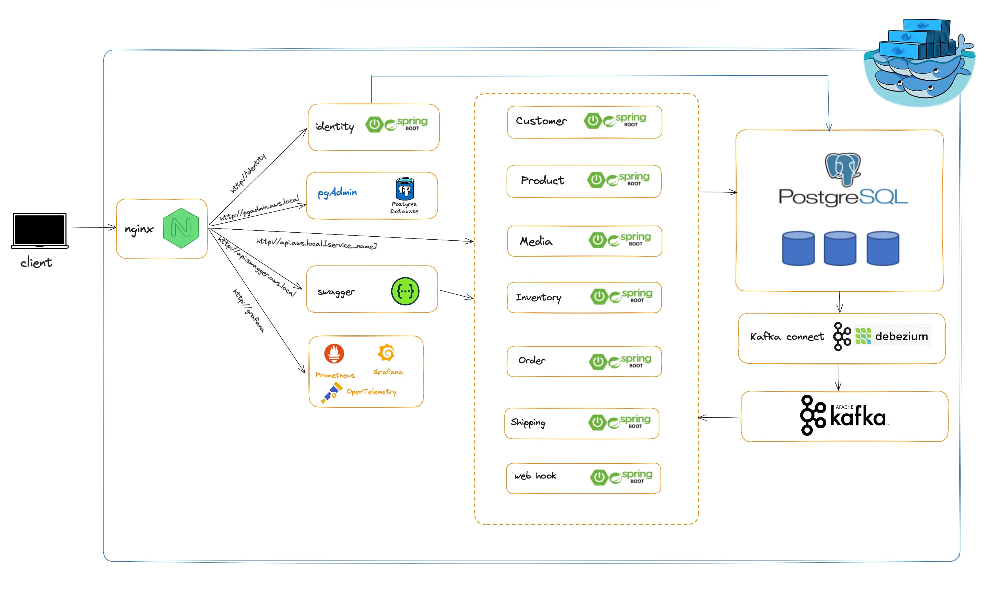

# Microservice with Java Spring Boot

## TODO

- [x] Microservices architectural style
- [x] Set up Java spring security
- [x] Set up Kafka connect debezium
- [ ] Response Caching - Distributed Caching with Redis
- [ ] Authentication && Authorization with Keycloak
- [ ] Monitoring và Metrics
- [ ] Service Discovery và Registry

## Tentative technologies and frameworks

- Java 21
- Spring boot 3.2
- Debezium
- Kafka
- PostgreSQL

## Local development architecture



## Getting started with Docker Compose

1. Get the latest source code
2. Add the following records to your host file:

```
127.0.0.1 identity
127.0.0.1 api.aws.local
127.0.0.1 kafka
```

1. Open terminal of your choice, go to `aws` directory, run `docker compose up`, wait for all the containers up and running

1. All the containers up and running then we start source connectors by run script, open any terminal window... go to the Aws root folder and type: ./start-source-connectors.sh
